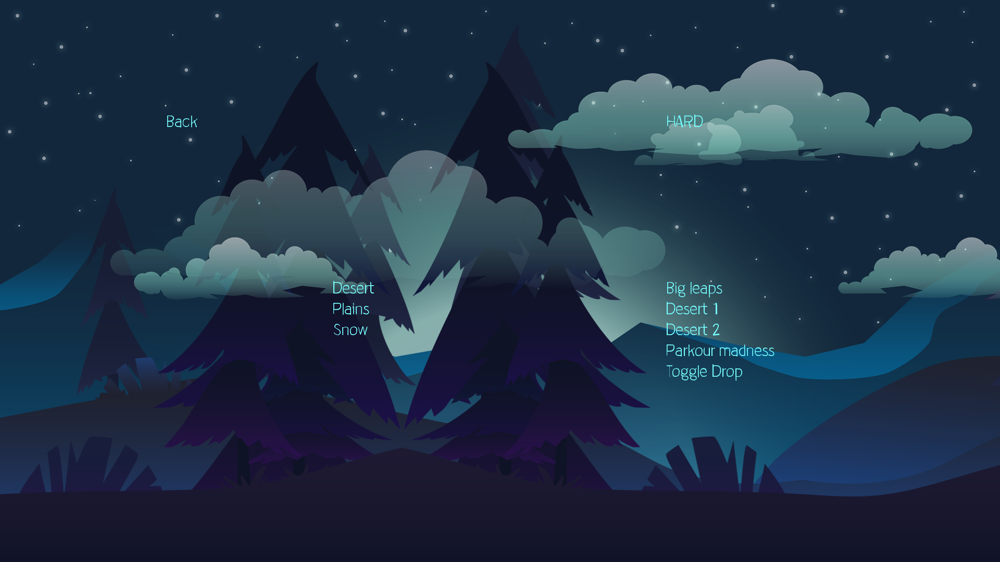
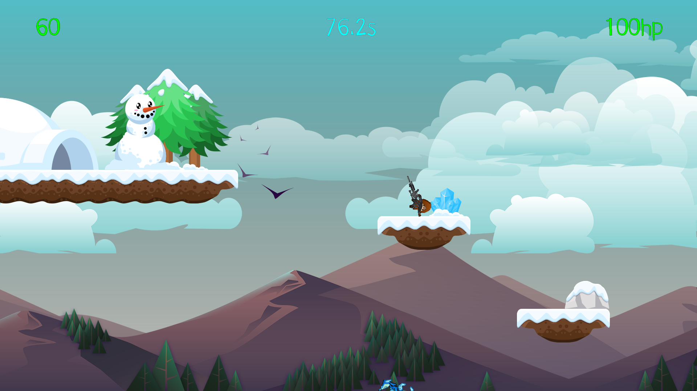
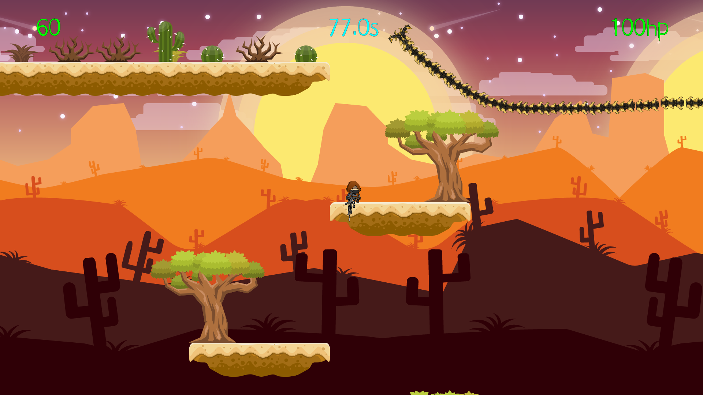
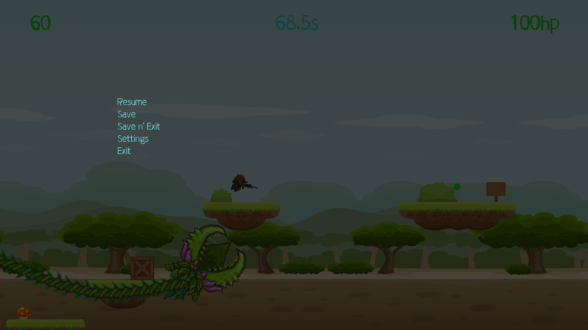

# envomp, taannu
## Lone Player

**url for the downloadable ->** [link to OneDrive](https://livettu-my.sharepoint.com/:f:/g/personal/envomp_ttu_ee/ErtQRSVPIiZOmXrDwzXh6TYBqK6eVO614J2ubSnqMCxwcQ?e=UXVvmo)

You find yourself on a prehistoric planet with nothing but your trusty M4 and Deagle.
You have 2 choises, either die or die with putting out a fight.

    
    
    
    

## Controls

| Control | button |
| ------ | ------ |
| Pause | ESC |
| Jump | SPACE |
| Dash | SPACE |
| Wall Jump | SPACE |
| Move left | A |
| Move right | D |
| Change dimension | S |
| Next weapon | E |
| Pervious weapon | Q |
| Shoot | MOUSE1 |
| Tab | TAB |

**May your parkour skills shine!**